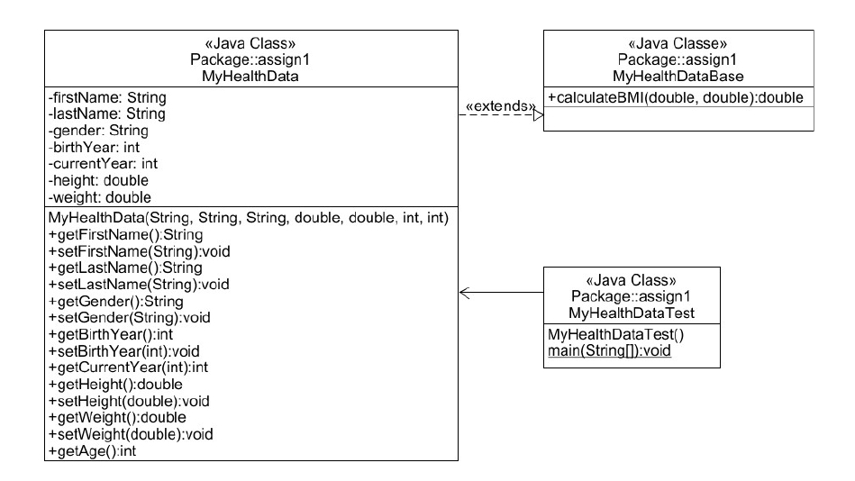

<h3>How does it work?</h3>

  •	Managed Records efficiently by capturing and processing patient data and facilitated the calculation of health metrics like BMI and heart rate. 
  •	Wrote the test plan and implemented Java Unit (JUnit) Testing to test methods. 
  •	Produced JavaDoc by providing meaningful comments for each method. 
  •	Engineered the backend logic and utilized Java's exception handling to ensure robustness against erroneous inputs. 

<h3 align="left">UML</h3>

  

